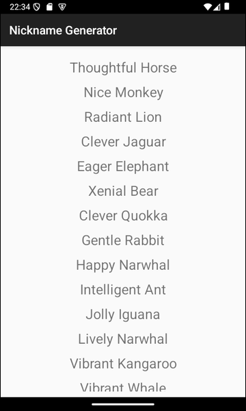

# Nickname Generator #

 

Dieses Repo enthält ein "Android Studio"-Projekt für eine native Android-App mit Java, die in einem
RecyclerView-Element eine Liste von ca. 600 zufällig erzeugter Nicknames anzeigt. 
Die Nicknames bestehen jeweils aus einem Adjektiv und einem Substantiv (beides Englisch), z.B. 
"Intelligent Ant" oder "Thoughtful Horse". 
Mit der App soll demonstriert werden, wie von einer SQL-Query zurückgelieferte Ergebniszeilen
in einem RecyclerView-Element angezeigt werden.

 

----

## License ##

 

 

----

## License ##

 

See the [LICENSE file](LICENSE.md) for license rights and limitations (BSD 3-Clause License).

 
